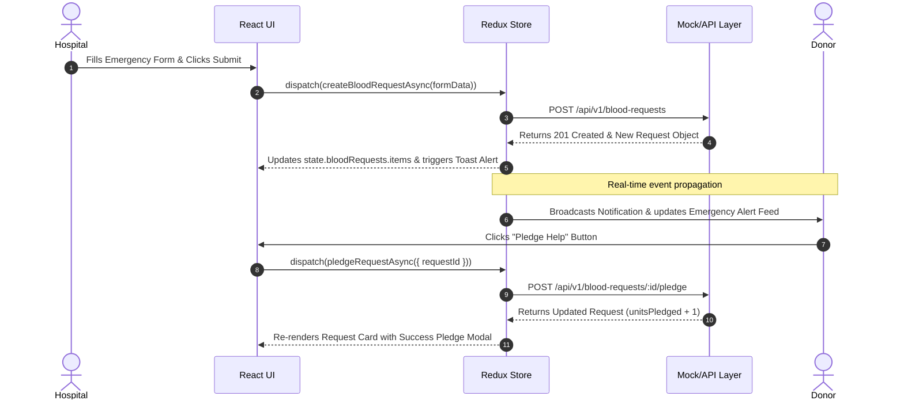

# 🔄 Data Flow Specifications - RedConnect

This document details sequence flows, data lifecycle transitions, and event propagation paths across RedConnect.

---

## 1. Emergency Blood Request & Pledge Flow



---

## 2. User Authentication & Token Refresh Flow

1. **User Credentials Submission**: User submits login form on `/login`.
2. **Action Dispatch**: `dispatch(loginUser({ email, password }))`.
3. **HTTP Interceptor**: Request sent via Axios in `authService.js`.
4. **Token Handling**: On success (`200 OK`), JWT token is extracted and stored in `localStorage` / memory state. `axios.defaults.headers.common['Authorization'] = 'Bearer ' + token`.
5. **State Update**: `authSlice` sets `user`, `role`, and `isAuthenticated: true`.
6. **Route Redirect**: `useNavigate()` redirects user based on role:
   - `donor` -> `/donor/dashboard`
   - `hospital` -> `/hospital/dashboard`
   - `ngo` -> `/ngo/dashboard`

---

## 3. Toast Notification Event Pipeline

```
[Trigger Action] (e.g. Pledge Success / Network Error)
       │
       ▼
[dispatch(addToast({ type: 'emergency', message, duration: 4000 }))]
       │
       ▼
[uiSlice Reducer appends object to state.ui.toasts array]
       │
       ▼
[ToastContainer component reads state.ui.toasts via useSelector]
       │
       ▼
[Framer Motion renders animated Toast component]
       │
       ▼
[setTimeout expires after 4000ms -> dispatch(removeToast(id))]
```

---

## 4. Form Validation Data Flow

- Form input powered by `React Hook Form` paired with `Zod` validation schemas.
- On keypress/blur: Zod evaluates field constraints (e.g. `bloodType` must match `['A+', 'A-', 'B+', 'B-', 'AB+', 'AB-', 'O+', 'O-']`).
- Errors populate `formState.errors` and map directly into component `<Input error={errors.bloodType?.message} />`.
