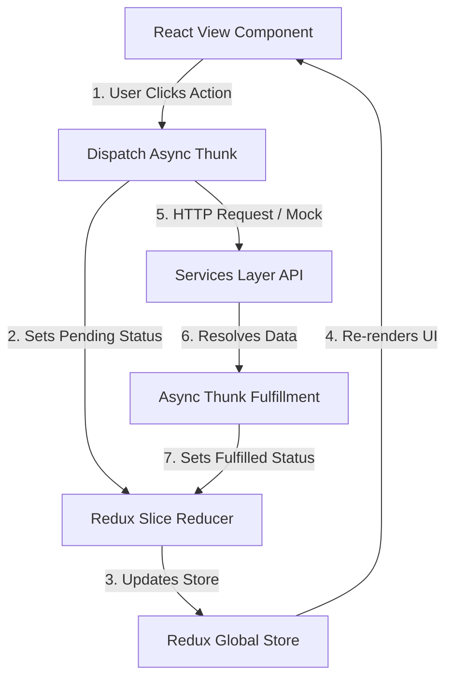

# ⚙️ System Architecture - RedConnect

This document details the architectural foundation of the RedConnect system, describing how React, Redux Toolkit, React Router, and the Service layer interact to form a scalable client application ready for enterprise backend integration.

---

## 1. High-Level Architecture Overview

RedConnect follows a clean **Unidirectional Data Flow Architecture** separated into three primary tiers: Presentation Tier, Application State Tier, and Data Services Tier.

```
+-----------------------------------------------------------------------+
|                           PRESENTATION TIER                           |
|  [Pages] ---> [Layout Wrappers] ---> [Domain & Common Components]      |
+-----------------------------------------------------------------------+
                                   |
                User Actions (Dispatch / Custom Hooks)
                                   v
+-----------------------------------------------------------------------+
|                        APPLICATION STATE TIER                         |
|  [Redux Toolkit Store]                                                |
|  ├── authSlice         ├── bloodRequestsSlice   ├── donorsSlice       |
|  ├── hospitalSlice     ├── notificationsSlice   ├── rewardsSlice      |
|  └── uiSlice                                                          |
+-----------------------------------------------------------------------+
                                   |
                Async Thunks / Service Interceptors
                                   v
+-----------------------------------------------------------------------+
|                        DATA SERVICES TIER                             |
|  [API Client / Axios Interceptor]                                     |
|  ├── Mock API Adapter (Initial Phase)                                 |
|  └── Node.js Express REST Backend (Future Phase)                      |
+-----------------------------------------------------------------------+
```

---

## 2. React Rendering Flow

1. **User Action Trigger**: User interacts with a DOM element (e.g., clicks "Pledge Donation" on an `EmergencyRequestCard`).
2. **Local Validation**: Form/input state validates parameters via custom hooks or Zod schema.
3. **Dispatch Action**: Component invokes a Redux action or custom hook method (e.g., `dispatch(pledgeRequestAsync({ requestId }))`).
4. **State Mutation**: Redux slice reducer processes the action, updating immutable state tree flags (`loading`, `data`, `error`).
5. **Re-render Cycle**: Connected UI components subscribe to modified slice state via `useSelector` and update dynamically without full page reloads.

---

## 3. Redux Data Flow Diagram



---

## 4. Client-Side Routing Architecture

RedConnect utilizes **React Router v6** with declarative nested route objects:

- **Root Router Container**: `AppRoutes.jsx`
- **Public Layout**: Encapsulates `LandingPage`, `EmergencyRequestsPage`, `BloodBanksPage`, `CampsPage`, `LoginPage`, `RegisterPage`.
- **Protected Donor Dashboard Layout**: Guarded by `ProtectedRoute` verifying `auth.isAuthenticated` and `role === 'donor'`.
- **Protected Hospital Dashboard Layout**: Guarded by `ProtectedRoute` verifying `auth.isAuthenticated` and `role === 'hospital'`.
- **Protected NGO Dashboard Layout**: Guarded by `ProtectedRoute` verifying `role === 'ngo'`.
- **404 Fallback Route**: Catches unmatched paths and renders `NotFoundPage`.

---

## 5. Component Hierarchy Strategy

RedConnect employs a hybrid **Atomic + Domain Component Hierarchy**:

- **Atoms / Common**: Pure, un-opinionated reusable components (`Button`, `Badge`, `Input`, `Avatar`, `Modal`, `Loader`, `Card`).
- **Molecules / Domain**: Context-aware components (`BloodTypeSelector`, `DonorStatusSwitch`, `EmergencyAlertCard`, `InventoryRow`).
- **Organisms / Views**: Complete view components mounted by routes (`EmergencyRequestsView`, `HospitalInventoryView`).

---

## 6. Modular Folder Organization

The system enforces strict file separation based on business domain:

```
src/
├── features/                  # Business domains (Alternative grouping)
│   ├── auth/                  # Login, Register, Tokens
│   ├── bloodRequests/         # Request wall, Pledge, Dispatcher
│   ├── inventory/             # Stock grid, Alert triggers
│   └── rewards/               # Points, Badges, Store
```

---

## 7. Future Backend Integration Blueprint

The frontend architecture is explicitly designed for a seamless transition from the **Mock Data Layer** to a live **Node.js / Express / MongoDB** or **Python FastAPI** backend:

### Service Interceptor Abstraction
All API calls pass through `src/services/apiClient.js`:

```javascript
// Base API configuration switching between Mock and Production REST API
import axios from 'axios';
import { MOCK_SERVICES } from './mockServices';

const IS_MOCK = import.meta.env.VITE_ENABLE_MOCK_DATA === 'true';

export const apiClient = {
  get: async (url, config) => {
    if (IS_MOCK) return MOCK_SERVICES.handleGet(url, config);
    return axios.get(url, config);
  },
  post: async (url, data, config) => {
    if (IS_MOCK) return MOCK_SERVICES.handlePost(url, data, config);
    return axios.post(url, data, config);
  }
};
```

This guarantees zero refactoring of UI components or Redux slices when connecting the live production REST API.
