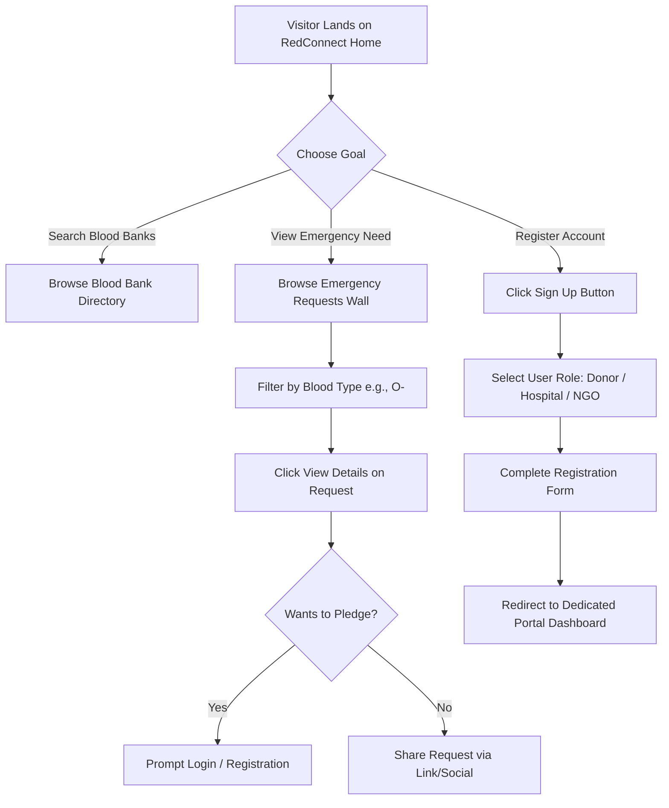
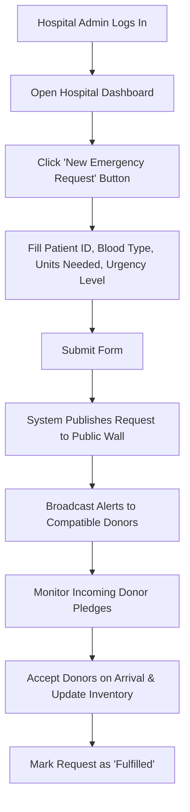

# 👥 User Flow Specifications - RedConnect

Detailed user journey workflows and Mermaid process flows for all 5 platform roles: Visitor, Donor, Hospital, NGO, and Administrator.

---

## 1. Visitor Flow (Public Access)

---

## 2. Donor Emergency Response Journey

1. **Alert Receipt**: Donor receives toast/notification: *"Critical O- Request at City General Hospital (3.2 km away)"*.
2. **Review Request**: Donor clicks notification to view full details (patient status, units required, hospital contact).
3. **Check Availability**: System verifies donor's last donation date is `> 56 days ago` and status is set to `Available`.
4. **Pledge Execution**: Donor clicks **"Pledge 1 Unit"**.
5. **Confirmation & Guidance**: Confirmation modal displays hospital address, contact person, and directions link. Request status increments pledged unit count.
6. **Hospital Arrival & Verification**: Hospital scans donor verification code upon arrival, marking donation complete and awarding **100 Reward Points**.

---

## 3. Hospital Emergency Request Journey

---

## 4. NGO Blood Camp Creation Journey

1. **Access NGO Portal**: NGO administrator logs into dashboard `/ngo/dashboard`.
2. **Initiate Drive**: Clicks **"Organize Blood Drive"**.
3. **Form Details**: Enters Drive Title, Date & Time, Venue Address, Target Unit Goal (e.g. 100 units), and Volunteer Contact Info.
4. **Publish Event**: Drive is listed publicly on `/camps`.
5. **Attendee Roster**: Public users click "Register to Attend", building live attendee list.
6. **Post-Event Audit**: NGO logs final units collected and issues digital badges to attendees.
